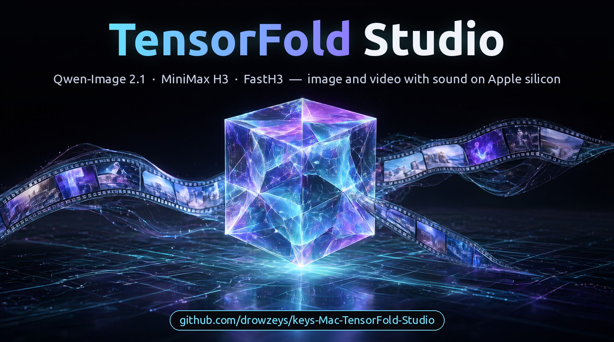
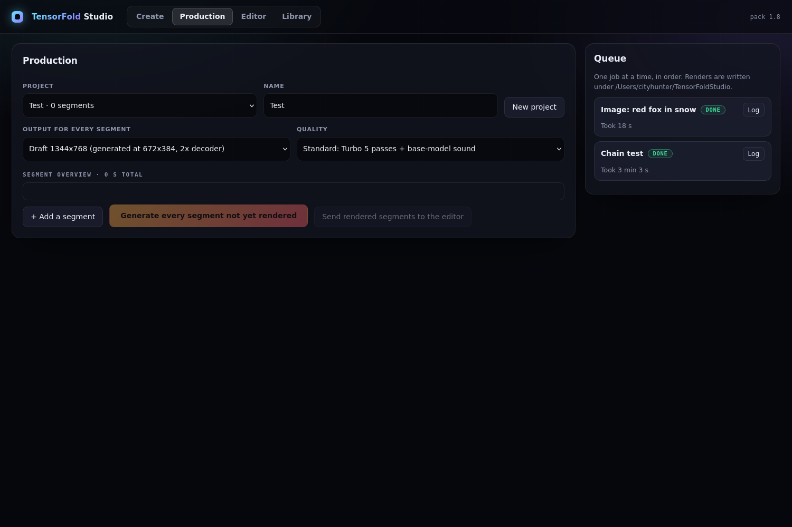
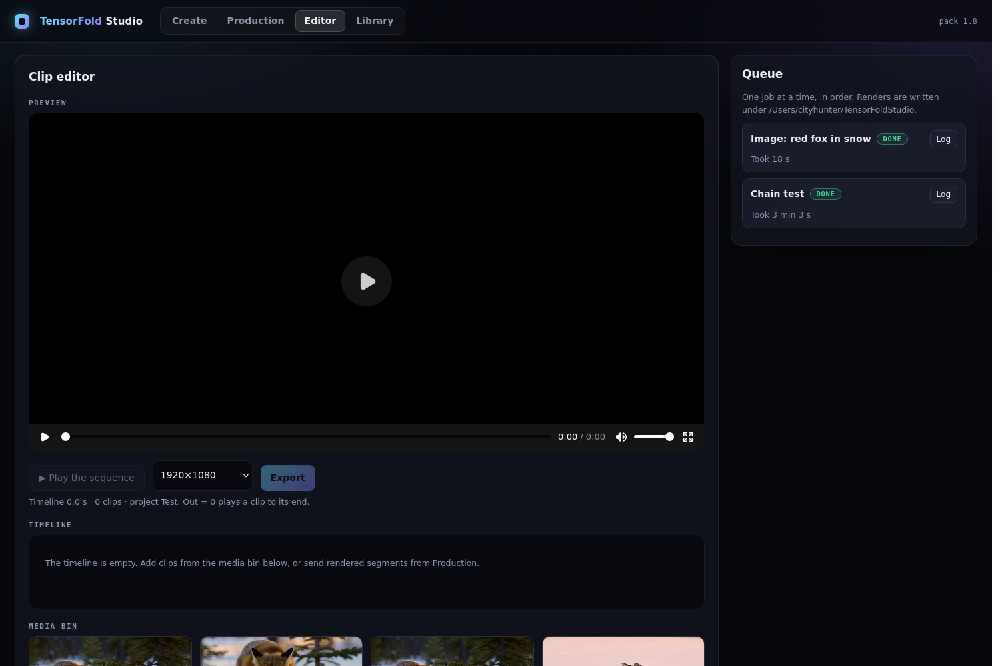
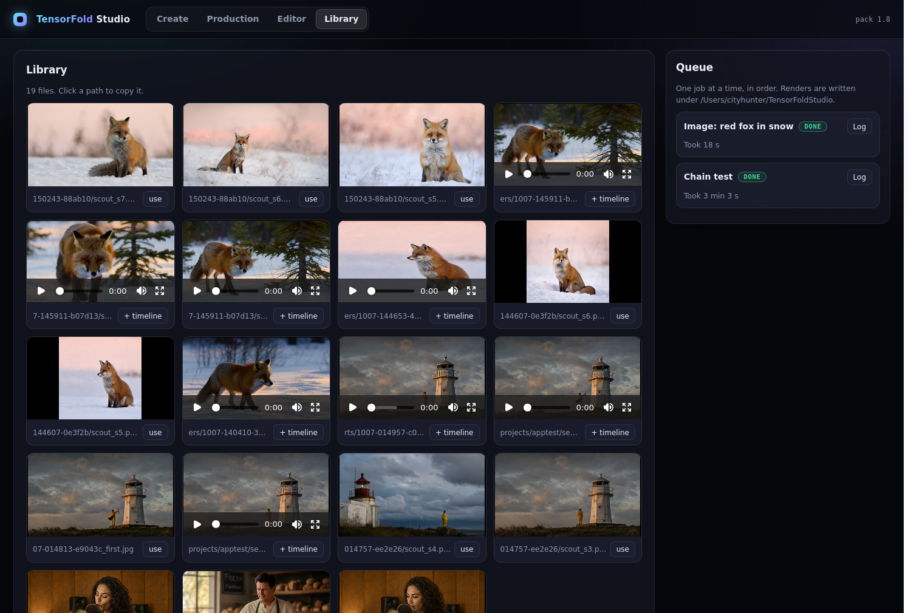

# keys-Mac-TensorFold-Studio (MiniMax H3 + Qwen-Image-2.1)

[](https://github.com/drowzeys/keys-Mac-TensorFold-Studio)

*Banner art made with this studio's own Qwen-Image-2.1 step (1664x928, seed 24); the lettering was set afterwards.*

**Thank you to everyone this stands on:** the Qwen team at Alibaba (Qwen-Image-2.1, Qwen3-VL), the MiniMax team
(MiniMax H3), Ash Hart and the TensorFold contributors, antirez (h3.c), RobZombAI (H3MLX), mrbizarro (minimax-h3-mlx /
Phosphene), Filip Strand and the mflux contributors, Viggle (the image turbo adapter), speach1sdef178 (the 2x video
decoder), LightX2V (the video Turbo adapter), NVIDIA Research (Sol-Engine, Sol-Attn, Sol-H3), FastVideo (FastH3), and Apple's MLX team and every MLX
contributor. This pack is their work, ported, pinned and measured. See [CREDITS.md](CREDITS.md). Built with Qwen.

**2.1** · Mac Studio M5 Ultra 256 GB · [TensorFold](https://github.com/ashhart/TensorFold) **0.6.5** + two families,
and TensorFold **1.0**'s native Zig runtime for FastH3:
**Qwen-Image-2.1** (text to image) and **MiniMax H3** (video with sound) · int8 kernels on the M5 tensor units ·
few-step adapters for both · a 2x video decoder for 2K finals

> **2.1 (2026-10-08): the default install is FastH3 only, and a clip now peaks at 32 GiB instead of 61.** FastH3 is
> the faster engine, so MiniMax H3's own transformer and its Turbo adapter are now an option (`--turbo`) instead of
> part of every install: 64 GB less to download, and the memory check drops from 128 GB to **64 GB on an M5-family
> Mac** (96 GB on earlier chips). Three changes made the room, none of which changes a pixel or a sample: the text
> encoder runs one layer at a time (47 GiB down to 2.4), the prompt export reads only the FastH3 weights it uses
> (69 GiB down to 28), and the decoders stop hoarding freed buffers (up to 60 GiB down to 14 to 32). Measured on
> the M5 Ultra; no 64 GB or 96 GB Mac has run it yet.
>
> **2.0 (2026-10-08): FastH3 runs on TensorFold 1.0's native Zig + Metal engine, from text or from an image.** Thank you to
> **Ash Hart** for the TensorFold 1.0 runtime and to **FastVideo / Hao AI Lab** for FastH3. Every transformer pass of
> a FastH3 clip now runs in a small native program with no MLX in the loop: **5.33 s a pass against 7.12 s** on the
> MLX engine at 864x480, 124 frames (6.14 s against 8.08 s from a Qwen-Image first frame), and a 10 second 1280x720
> clip in **388 s**. Prompt encoding and the video and audio decoders are still Python. Image generation and the
> Turbo adapter path are unchanged, on the MLX engine. `oneshot-setup.sh` installs the engine from the prebuilt
> carrier; nothing else changes in how you use the studio. See [The native engine](#the-native-engine-new-in-20).
>
> **1.9 (2026-10-07): a restyled web app with every choice on one screen, a one-click Mac app, and long videos.**
> Pick where the prompt goes (video or image only), the engine, passes, resolution, 2x upscale and a length from 5 s
> to 30 min (chained 15 s clips); `bash scripts/make-app.sh` builds a double-clickable app. See
> [Install](#install-and-the-one-click-app) and [Using the studio](#using-the-studio).
>
> **1.8 (2026-10-07): FastH3 text to video, 4, 8 or 20 passes, at 480p or 720p with an optional 2x decoder.**
> FastVideo's distilled FastH3 8-Step V2 now runs on a TensorFold tile-sparse attention kernel for the M5 tensor
> units: a 5 second 480p clip with sound in **51 s** (4 passes) or **78 s** (8), 720p in 112 s or 192 s, and 2K
> (2560x1440, through the 2x decoder) in 203 s. `bash scripts/fast.sh "a prompt" out.mp4`; see
> [FastH3](#fasth3-new-in-18). It also animates a Qwen-Image first frame: image and 5 second 480p clip in 103 s.
>
> **1.7 (2026-10-07): the 20-step mode is twice as fast.** `QUALITY=high` now uses a velocity cache and attention
> reuse after mlx-serve's fast recipe: a 10 second 1312x736 clip in 1,301 s against 2,763 s for plain 20 steps, with
> stills that hold up beside it. `QUALITY=full` keeps the plain 20 steps.
>
> **Update, 1.5 (2026-10-04): a new standard setting, and the best result this pack has made.** Video now takes
> **5 Turbo passes**, and the **sound is made again by the base model** against the finished picture. Judged by eye
> and ear by the pack's owner on speech and singing clips: 5 passes gave the best picture among 3, 4, 5 and 6, and
> the base-model sound fixed what was wrong with the adapter's (harsh, echo-like, thin). A 15 second clip takes 219 s
> this way against 606 s for the full 20 steps, which remain one switch away: `QUALITY=high`.

## Install, and the one-click app

### Minimum requirements

| What you want to run | Memory | Disk | Chip |
|---|---|---|---|
| Images only (`--image-only`) | **48 GB** | 33 GB | Any Apple silicon; M5 for the int8 kernels |
| The default: images and FastH3 video, the web app | **64 GB** | 175 GB | M5 family (the native engine needs its tensor units) |
| The default on an M4 or earlier | **96 GB** | 175 GB | FastH3 runs on the MLX engine there, slower |
| With `--turbo`: MiniMax H3 Turbo and its 20-step modes as well | **128 GB** | 240 GB | M5 family for the fast path |

The setup enforces the memory figures. All of this was measured on one machine, a Mac Studio M5 Ultra with 256 GB:
the figures below are what each stage of a job used there (`/usr/bin/time -l`, peak memory footprint), not a run
on a smaller Mac.

| FastH3 job, native engine (M5 Ultra, 2026-10-08) | Prompt export | Passes | Decode | **Peak** |
|---|---|---|---|---|
| 864x480, 5 s, from text | 27.7 | 23.0 | 14.0 | **28 GiB** |
| 864x480, 5 s, from an image | 27.9 | 23.1 | 14.0 | **28 GiB** |
| 864x480, 5 s, 20 passes | 28.0 | 23.2 | 13.9 | **28 GiB** |
| 864x480, 15 s | 27.8 | 28.2 | 16.9 | **28 GiB** |
| 1280x720, 5 s | 27.8 | 26.4 | 15.8 | **28 GiB** |
| 1280x720, 10 s | 27.9 | 32.1 | 19.6 | **32 GiB** |
| 1280x720, 5 s, 2x decoder to 2560x1440 | 27.8 | 26.4 | 32.1 | **32 GiB** |

The three stages run one after another, so a job's peak is its largest stage. An image job peaks at 28 GiB
(1344x768). Before 2.1 the same FastH3 jobs peaked at 48 to 69 GiB. Two things are larger and are why the other rows
of the first table exist: FastH3 on the MLX engine holds the whole checkpoint (67 GiB measured on the M5, with int8;
an earlier chip keeps it in bfloat16), and MiniMax H3 Turbo reaches 103 GiB while its adapter is merged.

| Machine | Status |
|---|---|
| Mac Studio M5 Ultra, 256 GB, macOS 27 | **Tested.** Every number in this README is from this machine. |
| M5 Max or M5 Pro, 64 GB or more | Untested. Meets the memory check for the default install with half the memory to spare; less GPU, so expect longer times. |
| M5 family, 48 GB | Untested. Images only (`--image-only`); the setup refuses video under 64 GB, though the measured peak is 32 GiB. |
| M4 and earlier, 96 GB or more | Untested. No tensor units: the int8 kernels and the native engine are skipped and FastH3 runs in bfloat16 on the MLX engine, far slower. |
| macOS 26 | Untested. The kernels need Metal 4, so it is the likely minimum. |

Installed size: about 175 GB, nearly all model weights (FastH3 65 GB, MiniMax H3's text encoder and decoders 72 GB,
Qwen-Image-2.1 31 GB, the image adapter and the 2x decoder 7 GB, Python environment 1.3 GB). `--turbo` adds 64 GB
(MiniMax H3's transformer 62 GB and the Turbo adapter 2 GB). The Studio's own code and the native engine are a few
megabytes. If you run it on another machine, a report of the chip, memory and times is welcome as an issue.

```bash
brew install python@3.11 uv ffmpeg
git clone https://github.com/drowzeys/keys-Mac-TensorFold-Studio.git
cd keys-Mac-TensorFold-Studio
bash oneshot-setup.sh --app             # engine, image model, FastH3, 2x decoder, the app; ends with a test clip
bash oneshot-setup.sh --turbo --app     # the same plus MiniMax H3 Turbo (64 GB more on disk, 128 GB of memory)
```

**Step-by-step tutorial with screenshots: [TUTORIAL.md](TUTORIAL.md).**

Then **double-click TensorFold Studio** on the Desktop or in `~/Applications` (drag it to the Dock if you like). `bash scripts/make-app.sh` rebuilds the app on its own. It starts the studio
if it is not running and opens it in your browser; double-click again to come back to it. Without the app:
`bash scripts/app.sh`, then open http://127.0.0.1:7870.

**Or hand it to your coding agent.** Paste this:

> Clone https://github.com/drowzeys/keys-Mac-TensorFold-Studio and follow its AGENTS.md section "Install for a
> person and build the one-click app". Tell me before any large download starts and when the app is ready.

`--turbo` adds MiniMax H3's own transformer and its Turbo adapter, and with them a second engine card in the app;
`--image-only` installs the image model alone (33 GB). An install made before 2.1 keeps Turbo. The app keeps the clone where it is: rebuild it with `make-app.sh` if you move the folder. To
stop the server: `"$HOME/Applications/TensorFold Studio.app/Contents/MacOS/TensorFoldStudio" stop`. There is **no
login**, and by default it listens on this Mac only; `HOST=0.0.0.0 bash scripts/make-app.sh` opens it to your
network, which you should do only on a network you trust.

## Using the studio


Step 1 of **Create** is where every choice lives. Pick one card in each row; the bar under them shows what will run
and roughly how long it takes.

| Choice | What it does |
|---|---|
| **The prompt goes to** | *Video with sound*, or *Image only*: Qwen-Image-2.1 makes the pictures and stops there. |
| **The clip starts from** | *Text only*; *a Qwen scout image* (step 2 makes several, you pick one); or *your own image* (step 2 uploads it). |
| **Video engine** (shown only with `--turbo` installed) | *FastH3*: fastest; text to video runs on the native Zig engine, and the bar under the cards says which engine a clip will use. *MiniMax H3*: the Turbo adapter with the sound made again by the base model, or the full 20 steps. |
| **Passes** (FastH3) | 4 (fastest, a little softer), 8 (what it was trained for), 20 (for prompts with several actions; slowest). |
| **Quality** (MiniMax H3, with `--turbo`) | Turbo 5 + base sound (the standard), Turbo 3, 20 steps with the fast recipe, or plain 20 steps. |
| **Resolution** | 480p (864x480), 720p (1280x720), or the fixed outputs Draft, 2K 2048x1152 and Native 1344x768. |
| **2x upscale** | For 480p and 720p: the 2x decoder turns 480p into 1728x960 and 720p into 2560x1440, for about 10 s more. |
| **Length** | 5, 8, 10 or 15 s as one clip; 30 s to 30 min as a chain of clips (below). |
| **Seed** | Same seed and settings give the same clip. |

Then write the picture, what happens, and optionally the camera move. Steps 3 to 5: add spoken or sung lines and
the soundscape, review the exact prompt the model will receive (edit it freely), and queue the render. The **Queue**
on the right shows progress by pass, a time estimate, the log, and a cancel button.

### Image only


Choose *Image only*, describe the picture, pick a size and how many takes. Each image has **Download** and
**animate this**, which carries it into a video as the first frame.

### Qwen image, then video


Choose *A Qwen scout image*. Step 2 makes as many candidates as you ask for (six take about half a minute) at the
size the video model starts from; click the one you want. Either engine animates it. With FastH3 this is an
untrained use that worked in our one test (see [FastH3](#fasth3-new-in-18)).

### Long videos, up to 30 minutes


The model makes at most 15 s at a time, so anything longer is a **chain**: each 15 s clip opens on the last frame
of the one before, and the clips are joined into one file (the repeated frame at each join is dropped). Pick a
length from 30 s to 30 min. **Story beats** are optional, one line per clip, saying what happens in that part;
without them every clip gets the same prompt. Finished clips can be watched from the queue while the rest render.

- Checked: an 18 s chain of two clips (FastH3, 4 passes, 480p) in 183 s; the join is not visible in stills and the
  second clip followed its own beat. **Nothing longer has been rendered.** The times shown for long lengths are
  extrapolated from 5 s clips: about 7 hours for 30 minutes at 480p with 4 passes, about 11 hours with 8.
- Expect drift: each clip only sees one frame of the last, so faces, clothes and light can wander over many clips,
  and sound does not carry across a join. For a planned story with different shots, use Production instead.

### Production, Editor, Library



**Production** is for a video planned shot by shot: a project of segments, each with its own scene, action, line and
length. A segment can open on the last frame of the one before; one button renders every segment not yet done.



**Editor** is a single-track timeline: order the clips, set in and out points, preview the sequence, export one file.



**Library** lists every render, scout and export; *use* makes an image the first frame of a new clip, *+ timeline*
sends a clip to the editor.

The app drives the same scripts as the command line, one job at a time, and keeps projects, uploads and renders
under `~/TensorFoldStudio`. What it is not: the editor has one video track with trims and ordering only (no
transforms, text, transitions or audio mixing), and there is no assisted prompt writing. The workflow is modelled
on rookiestar28's ComfyUI-MiniMaxH3-Studio, which does far more; no code is shared with it.

## FastH3 (new in 1.8)

**Credit first: FastVideo / Hao AI Lab** made FastH3 (the distilled weights and the sparse-attention routing they
were trained with), on **MiniMax's** H3. What this pack adds is the attention kernel that makes it fast on a Mac.

```bash
bash scripts/fast.sh "a prompt" out.mp4                      # 480p (864x480), 8 passes
STEPS=4 bash scripts/fast.sh "a prompt" out.mp4              # 4, 8 or 20 passes
RES=720p bash scripts/fast.sh "a prompt" out.mp4             # 1280x720
UPSCALE=1 bash scripts/fast.sh "a prompt" out.mp4            # 480p generated, 2x decoder: 1728x960
RES=720p UPSCALE=1 bash scripts/fast.sh "a prompt" out.mp4   # 720p generated, 2x decoder: 2560x1440 (2K)
# Qwen-Image-2.1 makes the first frame, FastH3 animates it (all the studio.sh presets work: X2=1, TWOK=1, QHD=1)
ENGINE=fasth3 STEPS=8 WIDTH=864 HEIGHT=480 bash scripts/studio.sh "the picture" "what happens" out.mp4
```

In the web app FastH3 is the first card under **Video engine**, with Passes, Resolution and 2x upscale beside it.

Measured on a Mac Studio M5 Ultra (64-core GPU, 256 GB), 5 second clips of 124 frames with sound, one run each,
whole command including model load and decode:

| Output | Generated at | 4 passes | 8 passes | 20 passes |
|---|---|---:|---:|---:|
| 480p, 864x480 | 864x480 | 51 s | 78 s | 174 s |
| 480p + 2x decoder, 1728x960 | 864x480 | | 88 s | |
| 720p, 1280x720 | 1280x736, cropped | 112 s | 192 s | 434 s |
| 720p + 2x decoder, 2560x1440 | 1280x736, cropped | | 203 s | |

A pass takes 7.1 s at 480p and 19.7 s at 720p; the 2x decoder adds about 10 s. A 10 second 1312x736 clip (243
frames) takes 478 s at 8 passes, against 2,183 s with FastVideo's own Metal kernel in the same engine.

- **8 passes** is what the checkpoint was trained for. **4** and **20** spread that many rungs evenly over the same
  schedule: by eye on one prompt, 4 is a little softer and 20 has more texture. Neither is a setting FastVideo
  trained or tested. FastVideo's dedicated 4-step preview checkpoint was tried too and looked no better than V2 at
  4 passes for the same time, so the pack uses one checkpoint for all three.
- **2x of 480p is 1728x960**, which is above 720p, not exactly 720p. For a 1344x768 clip generated at half size,
  the Turbo path's `X2=1` draft preset does that.
- **Why it is fast.** FastH3 lets each 64-row tile of the video attend to the text and audio rows and to the best
  fifth of the video tiles. The kernel gives one threadgroup one query tile of one head and walks only the chosen
  key tiles, read in place, with int8 scores and values. At 69K rows a block takes 0.52 s against 1.93 s for dense
  attention. The int8 scores pick a few different tiles than FastVideo's float reference would, so details differ
  from its output (cosine 0.9999 on random inputs; not a bit-exact port).
- **Image to video works, though FastVideo trained FastH3 on text to video only.** One test (the baker prompts,
  864x480, 8 passes): the clip opens on the Qwen image, keeps the face and follows the prompt; image 9 s, video
  94 s. The first-frame rows join the rows every video tile always attends to. Not tested widely.
- The sound is FastH3's own; the base-model audio step is not applied here.
- FastH3 weights are a derivative of MiniMax H3 under the MiniMax H3 Community License.

## The native engine (new in 2.0)

**Credit first: Ash Hart and the TensorFold contributors** wrote the TensorFold 1.0 runtime this uses (Zig driving
Metal directly, Apache-2.0), and **FastVideo / Hao AI Lab** made FastH3. What this pack adds is an H3 family for that
runtime: FastH3's block stack, its tile-routed attention and its int8 kernels for the M5 tensor units.

| What | Where it runs |
|---|---|
| FastH3, from text or from a first frame (a Qwen scout, your own image, every part of a long chain): all transformer passes (rows in, 50 blocks, routing, attention, both output heads) | `tf-h3-dit`, the native Zig + Metal program |
| Prompt encoding, the first frame's encoding, the checkpoint's small projections and timestep tables | Python (MLX), once per clip |
| Video decoder, audio decoder, MP4 | Python (MLX), as before |
| Qwen-Image-2.1, the Turbo adapter path, the 20-step path, the base-model audio step | MLX engine, unchanged |

`scripts/video.sh` picks the native engine for a FastH3 clip when it is installed and the chip has tensor units (M5
or later); it prints `[tensorfold] engine: zig` or `engine: mlx (why)`, and the web app
shows the same on the job. `FASTH3_ENGINE=mlx` or `zig` forces one.

Measured on a Mac Studio M5 Ultra (64-core GPU, 256 GB), FastH3 with sound, text to video unless a row says from
an image, one run each, whole command including export and decode unless a row says per pass:

| Clip | Native engine | MLX engine |
|---|---:|---:|
| 864x480, 124 frames, per pass | 5.33 s | 7.12 s |
| 864x480, 5 s, 4 passes | 43 s | 51 s |
| 864x480, 5 s, 8 passes | 66 s | 78 s |
| 864x480, 5 s, 20 passes | 129 s | 174 s |
| 864x480, 124 frames, from a Qwen-Image first frame, per pass | 6.14 s | 8.08 s |
| 864x480, 5 s, 8 passes, from a first frame (image already made) | 72 s | 90 s |
| 1728x960 through the 2x decoder, 5 s, 8 passes, from a first frame | 77 s | not run |
| 18 s chain of two clips, 864x480, 4 passes | 156 s | 183 s |
| 1280x720, 5 s, 8 passes | 199 s | 259 s |
| 1280x720, 10 s (243 frames), 8 passes | 388 s | about 480 s (53 s a pass; not re-run) |
| 1280x720, 10 s (243 frames), 20 passes | about 950 s (45 s a pass plus export and decode) | not run |

The two 1280x720, 5 s figures come from one sitting with another job using the machine on and off, so both are
slower than a quiet run would be (the MLX figure was 192 s when first measured); read them as a ratio.

- **Quality.** The native engine and the MLX engine both use int8 arithmetic and agree with a float reference to the
  same degree on the first pass (video cosine 0.961 and 0.966). The same seed gives the same shot with different
  details, not the same pixels. The clips were judged by eye by the pack's owner; the native engine's attention
  weights are 8-bit.
- **20 passes** is the setting to reach for when a prompt has several distinct actions: in two tests it brought in
  action the 8-pass clip had skipped and removed an object glitch. It is not a setting FastVideo trained.
- **Sizes.** The routing cuts the video into tiles of 4x4x4 tokens (128 pixels a side, 17 frames deep). A size that
  is not whole tiles is padded inside the attention. Rounding the size up instead is not faster at the same length
  (896x512 took 5.75 s a pass against 5.33 s for 864x480 at 124 frames), so the studio generates the size you ask
  for. Lengths of 107, 175, 243 and 311 frames are whole tiles in time; 243 is the 10 second choice.
- **From an image.** A first frame's rows sit between the text and the audio, enter on every pass at the keyframe
  noise level and are never stepped, as in the MLX engine. On the baker test the clip opens on the given image
  (frame 0 against the image: 33.7 dB on both engines) and the first pass agrees with the float reference as closely
  as the MLX engine's does (video cosine 0.995 and 0.997). One image and prompt at 864x480, plus the app tests.
- **Not in the native engine yet:** the prompt encoder, the first-frame encoder, the decoders, Qwen-Image. A Qwen-Image
  transformer for the same runtime exists in the fork and is level with the MLX one (0.483 s against 0.477 s a pass
  at 1344x768), so the studio keeps the MLX one.
- **Install.** `oneshot-setup.sh` copies the engine from the carrier image's payload (a 0.7 MB program, its Metal
  kernels inside it, compiled when it starts). Without Docker it builds from source if `zig` 0.17 and Xcode's Metal
  toolchain are present (`scripts/build-zig-engine.sh`); with neither, FastH3 stays on the MLX engine and everything
  still works.

## How it works

1. **You write two prompts**: what the picture shows, and what happens in the clip (action, spoken or sung words,
   sound).
2. **Qwen-Image-2.1 makes the first frame** from the first prompt, in about 10 seconds with its turbo adapter. Or it
   makes several scouts for you to choose from.
3. **MiniMax H3 animates that frame** from the second prompt, with sound, in one of two modes:
   - **Standard (Turbo 5).** The Turbo adapter denoises picture and sound together in 5 passes. The adapter is then
     dropped and the base model denoises the sound again from scratch, 20 steps, with the finished picture held
     fixed. Each of those steps recomputes only the audio rows (about 4% of the sequence) against the picture's
     stored attention keys and values, so 20 steps cost less than one full pass.
   - **High quality (`QUALITY=high`).** The base model denoises picture and sound together for 20 steps, no adapter.
     About three times slower; calmer motion, softer picture, and the sound the standard mode's audio step is
     borrowed from.
4. **The decoders finish it.** The video decoder turns latents into frames, optionally at twice the size (the 2x
   decoder, for 2K). The audio decoder's output is kept clear of clipping, and a take that comes out thin gets its
   bass lifted.

Both transformers, the samplers, the adapter merges, the audio step, the int8 kernels and the image and video
decoders run in TensorFold on MLX.

**Scout, pick, animate, finish in 2K.** Six scout images from one prompt in 27 seconds; pick one; MiniMax H3 animates
it with sound and a 2x decoder finishes it in 2K: an 8 second clip at 2048x1152 in five minutes, or at 2560x1440 in
under eleven. A 1344x768 draft of the same 8 seconds takes 108 seconds.


The newest sample, made with the standard setting: [`samples/singer_standard_8s.mp4`](samples/singer_standard_8s.mp4)
(prompts `singer-image.txt` and `singer-video-8s.txt`). The baker clips below predate 1.5.

Prompts: [`prompts/baker-image.txt`](prompts/baker-image.txt) for the picture,
[`prompts/baker-video.txt`](prompts/baker-video.txt) for what happens. Clips: [`samples/`](samples/).

## The base-model audio step

*This section and the Turbo rows in "How it works" and "Measured" describe MiniMax H3 Turbo, which since 2.1 is
installed only with `oneshot-setup.sh --turbo`. FastH3, the default, makes its picture and sound together.*

The Turbo adapter is what makes the picture fast, and it is also what spoils the sound. So the sound is made twice:
once with the picture, by the adapter, and thrown away; then again by the base model, which is the one that sounds
right.

1. After the Turbo passes, the adapter-merged model is unloaded and the released weights are loaded (4 s).
2. The finished picture, the first frame and the prompt go through the model once, held still, and every block's
   attention keys and values over them are stored.
3. The audio starts again from noise and is denoised in 20 steps. Each step runs only the audio rows (1,206 of 29,009
   on a 15 second clip) against the stored keys and values: about 1.3 s a step instead of 24 s.

It is on by default whenever the adapter is used. `REVOICE=0` keeps the adapter's own sound; `REVOICE=<steps>` sets the
number of audio steps (20 is the only value tried). It was offered upstream (ashhart/TensorFold#405) and closed with the H3 family; it lives in the fork.

## The workflow

```bash
# 1. Scout: several first frames from one prompt, one model load (27 s for six), with a contact sheet
bash scripts/scout.sh "A lighthouse keeper in a yellow raincoat on a cliff at dusk, storm clouds behind him" 6 scouts/keeper
open scouts/keeper/sheet.jpg

# 2. Draft the motion from the one you like: 8 s at 1344x768 in under two minutes
IMAGE_FILE=scouts/keeper/scout_s3.png X2=1 FRAMES=192 bash scripts/studio.sh "" \
    "He raises a lantern, wind pulls at his coat, waves crash below. He says: Storm's coming." draft.mp4

# 3. Finish in 2K: same image, same prompt. TWOK=1 is 2048x1152 (5 min), QHD=1 is 2560x1440 (11 min)
IMAGE_FILE=scouts/keeper/scout_s3.png QHD=1 FRAMES=192 bash scripts/studio.sh "" \
    "He raises a lantern, wind pulls at his coat, waves crash below. He says: Storm's coming." final.mp4
```

Or all at once, with no picking: `TWOK=1 bash scripts/studio.sh "the picture" "what happens" out.mp4`.

- **Scouts are made at 1280x736**, which is exactly the frame the video model starts from for a 2560x1440 clip, so
  the scout you pick is the frame the clip opens on, with no resize in between.
- **Why 736 and not 720.** The video model needs sides in multiples of 32, and 720 is not one. The 2K preset
  generates at 1280x736, decodes at 2x to 2560x1472 and centre-crops 16 rows top and bottom to 2560x1440.
- **The draft and the final are different renders.** The draft generates at 672x384 and the final at 1280x736, so the
  motion is similar in kind, not frame for frame.

## Measured (2026-10-04, Mac Studio M5 Ultra 256 GB, macOS 27.0.1, one run each)

### Text to image to video (`scripts/studio.sh`), 8 second clips unless noted

| Output | Video generated at | Standard: Turbo 5 + base-model sound | Earlier: Turbo 3, adapter sound |
|---|---|---:|---:|
| Six scout images, 1280x736 (`scripts/scout.sh`) | | 27 s | 27 s |
| 1344x768, 2x decoder (`X2=1`) | 672x384 | **108 s** | 67 s |
| **2048x1152, 2x decoder (`TWOK=1`)** | 1024x576 | **299 s** | 151 s |
| **2560x1440, 2x decoder (`QHD=1`)** | 1280x736 | **635 s** | 352 s |
| 1344x768, native decode | 1344x768 | 709 s | 364 s |
| 864x480, native decode | 864x480 | 174 s | 98 s |
| 864x480, 5 s (124 frames), native decode | 864x480 | 103 s | 74 s |

Totals include the image (9-12 s). Where the standard time goes, 2048x1152: five passes 185 s (37 s each), the sound
made again 60 s, decode 31 s, loading and text 12 s. At 2560x1440: passes 436 s, sound 119 s, decode 55 s. The audio
step costs about one and a third passes at every size: one full pass to store the picture's keys and values, then 20
light steps.

`QUALITY=high` (20 steps, no adapter) took 606 s for a 15 second clip generated at 672x384, against 219 s at the
standard setting; it has not been timed at the sizes above.

The earlier column was measured with `POINTS=4 REVOICE=0`, which still works.

**Resolution costs far more than length.** The video model works on one row per 32x32 pixels of every latent frame,
and attention compares every row with every other, so its cost grows with the square of the row count. 5 s at 864x480
is 16,500 rows (9.5 s per pass); 8 s at 864x480 is 24,826 rows (18.3 s per pass); 8 s at 1344x768 is 60,403 rows
(104.6 s per pass). Going from 864x480 to 1344x768 is 2.5 times the pixels and 4 times the time for the same length.

**What the 2x decoder is.** A replacement head for H3's own video decoder (speach1sdef178's MiniMax-H3-X2-Detail-VAE)
that turns the same latents into frames twice as large along each side, in the normal decode time. It is an upscale: a
1344x768 clip decoded from a 672x384 generation is softer than one generated at 1344x768, with stair-steps on
high-contrast edges ([comparison](samples/x2_compare.jpg): native on top, 2x below). It earns its place twice: as a
6 times faster draft, and as the last step to 2K from a full-size generation, where the 2560x1440 clip costs no more
than the 1344x768 one. With `QHD=1` or `TWOK=1` the first frame is made at the size the video model starts from
(1280x736 or 1024x576), since a larger picture would only be shrunk again.

Wall time from the command to the finished files, both models loaded from disk each time, int8 kernels on. In every clip the baker lifts the loaf, speaks the scripted line
(checked by speech recognition) and smiles. The 864x480 run was the first after install, so its 14 s includes a cold
read of the text encoder.

### Qwen-Image-2.1 alone, 1344x768, same prompt and seed

| Path | Steps | Per step | Denoise | Whole run |
|---|---:|---:|---:|---:|
| mflux `add5164`, bfloat16 (the reference this port is checked against) | 40 | 0.73 s | 29 s | 40.7 s |
| TensorFold, bfloat16 | 40 | 0.78 s | 31.0 s | 34.3 s |
| TensorFold, int8 kernels | 40 | 0.48 s | 19.2 s | 24.3 s |
| **TensorFold, int8 kernels + Viggle turbo adapter** | **6** | 0.50 s | **3.0 s** | **9.2 s** |


Top: mflux, TensorFold bfloat16. Bottom: TensorFold int8, TensorFold int8 turbo. Against the mflux image the
TensorFold bfloat16 image is 32.7 dB and the int8 image 30.4 dB: the same picture with different fine detail. Turbo
gives the same scene with a different rendering.

- **Per step in bfloat16, mflux is slightly faster than this port** (0.73 s against 0.78 s). The gain comes from the
  int8 kernels (1.6x per step) and the 6-step adapter.
- **MiniMax H3 numbers**, the shootout against h3.c, H3MLX and minimax-h3-mlx, and what makes H3 fast are in the
  video-only pack: [keys-Mac-TensorFold-MiniMax-H3-MLX](https://github.com/drowzeys/keys-Mac-TensorFold-MiniMax-H3-MLX).
  At 20 steps the C engines are faster and sharper than TensorFold; TensorFold leads only with the Turbo adapter.

## One-shot

```bash
git clone https://github.com/drowzeys/keys-Mac-TensorFold-Studio.git
cd keys-Mac-TensorFold-Studio
brew install python@3.11 uv ffmpeg
bash oneshot-setup.sh               # both models and the 2x decoder: 182 GB of weights
bash oneshot-setup.sh --image-only  # or just Qwen-Image-2.1: 33 GB
```

`oneshot-setup.sh` does the following:

1. Gets TensorFold 0.6.5 with the H3 and Qwen-Image families (`drowzeys/TensorFold` at `a2068c03`), from the **GHCR
   prebuilt carrier** when Docker is available (checksums verified), otherwise from git at the same commit.
   The native FastH3 engine (`tf-h3-dit`) comes from the same carrier, or without Docker as a checksummed download
   from the [v2.0 release](https://github.com/drowzeys/keys-Mac-TensorFold-Studio/releases/tag/v2.0); no Zig toolchain is needed.
2. Installs it with mflux at `add5164e` and the dependency lock ([`requirements.lock`](requirements.lock): mlx 0.32.3,
   mlx-lm 0.32.0, mlx-vlm 0.7.4, …) into its own venv at `~/.local/opt/tensorfold-studio`.
3. Downloads `Qwen/Qwen-Image-2.1` (33 GB) to `~/qwen-models/Qwen-Image-2.1` and the Viggle turbo adapter (1.36 GB,
   checksum verified).
4. Unless `--image-only`: clones minimax-h3-mlx at `79190205`, downloads the FastH3 transformer (65 GB), the MiniMax
   H3 `FL2VA` partition without its transformer (72 GB: the text encoder and the two decoders) to
   `~/h3-models/MiniMax-H3` and the 2x video decoder (5.2 GB, checksum verified). With `--turbo`, the whole
   partition (134 GB) and the video Turbo adapter (1.96 GB, checksum verified).
5. Renders a test: a 5 second clip from a generated image (`outputs/test.png`, `outputs/test.mp4`), or a test image
   with `--image-only`.

Override `PREFIX`, `QWEN_MODEL_DIR` or `H3_MODEL_DIR` through the environment. `--verify` checks an existing install;
`--no-render` skips the test.

`studio.sh` and `video.sh` use MiniMax H3 Turbo when it is installed (`--turbo`) and FastH3 otherwise; `ENGINE=fasth3`
or `ENGINE=h3` picks one. `QUALITY=high` and `QUALITY=full` need `--turbo`. For FastH3, `WIDTH=864 HEIGHT=480` and
1280x736 are the sizes measured here.

### Text to image to video

```bash
bash scripts/studio.sh "A lighthouse keeper in a yellow raincoat on a cliff at dusk, storm clouds behind him" \
                       "He raises a lantern, wind pulls at his coat, waves crash below. He says: Storm's coming." \
                       out.mp4
```

The image is written beside the clip (`out.png`). Defaults: 1344x768, 124 frames (5 s), native decode. `QHD=1` makes
a 2560x1440 clip; `X2=1` generates the video at half of `WIDTH` x `HEIGHT` and decodes at 2x (multiples of 64, up to
2688x1536); `IMAGE_FILE=picture.png` animates an image you already have. Set `FRAMES=192` for 8 seconds, `WIDTH`/`HEIGHT` for another canvas (multiples of 32, at most 768x1344 pixels in total, the video model's
released limit), `SEED`, or `IMAGE_SEED` and `VIDEO_SEED` separately. The script opens the video prompt with the line
MiniMax's own image-to-video prompts use; `RAW_PROMPT=1` passes yours untouched.

### Image only

```bash
bash scripts/image.sh "A neon shop sign that reads OPEN LATE, rainy night, reflections on wet pavement" out.png
TURBO=0 bash scripts/image.sh "..." out.png                 # 40 steps, base model
WIDTH=2048 HEIGHT=2048 bash scripts/image.sh "..." out.png  # sizes in multiples of 16
```

### Video only, or from your own image

```bash
bash scripts/video.sh "A hummingbird hovering over red flowers, soft wing hum" out.mp4
FIRST_FRAME=photo.jpg WIDTH=1344 HEIGHT=768 bash scripts/video.sh "She turns to the camera and smiles" out.mp4
QUALITY=high bash scripts/video.sh "..." out.mp4            # 20 steps, no adapter
```

`FRAMES` must be `17n + 5` (56, 73, 90, 124, 192, 243, 362). `FIRST_FRAME` is stretched onto the canvas, so match its
aspect ratio.

### GHCR prebuilt carrier

```bash
docker pull ghcr.io/drowzeys/keys-mac-tensorfold-studio:2.1
# index digest: sha256:ef1c4d26251639ae353722fe3374e7eddf8383aa20ef03341fe64a03553c90b5 (linux/arm64 + linux/amd64)
docker run --rm -v "$PWD":/out ghcr.io/drowzeys/keys-mac-tensorfold-studio:2.1 cp -a /payload/. /out/payload/
```

The carrier holds the TensorFold wheel, `requirements.lock`, the render scripts, the prebuilt native FastH3 engine (`zig-engine/tf-h3-dit`, built for Apple Silicon at the pinned commit) and `SHA256SUMS`. **It is not a
Mac runtime**: Metal does not run in a container, so `oneshot-setup.sh` installs the payload natively. Rebuild it with
`PUSH=1 bash scripts/build-carrier.sh`.

## Stack

| Piece | Value |
|---|---|
| Host | Mac Studio M5 Ultra, 256 GB, macOS 27.0.1 |
| Engine | TensorFold 0.6.5 (`609ca419`) + twelve commits, `drowzeys/TensorFold` branch `studio` @ `a2068c031e08109a0ec14c26b1ca655cf50ac34c` (Apache-2.0) |
| Native engine (FastH3) | TensorFold 1.0.2's Zig + Metal runtime + an H3 family, `drowzeys/TensorFold` branch `h3-firstframe` @ `4741fd0adef0b8864bfb61f12464682e645ec3b7`; built with Zig 0.17 |
| Image model | `Qwen/Qwen-Image-2.1`: 7B transformer (32 blocks, bfloat16), 64-channel VAE, Qwen3-VL text encoder |
| Image adapter | `Viggle/Qwen-Image-2.1-viggle-turbo`, v0.3, rank 256, 6 steps on its trained nodes |
| Video model | `MiniMaxAI/MiniMax-H3`, `FL2VA` partition: 33B transformer, Qwen3-VL text encoder, video and audio VAEs |
| Video adapter | lightx2v MiniMax H3 Turbo v1.0, runner layout as published by Phosphene |
| 2x video decoder | `speach1sdef178/MiniMax-H3-X2-Detail-VAE`, `MiniMax-H3-X2-Detail-v1.safetensors` (decoder only; its reference-detail branch is not used) |
| Borrowed at run time | mflux @ `add5164e`: Qwen-Image prompt encoder. minimax-h3-mlx @ `79190205`: H3 text encoder, first-frame encoder, audio decoder, MP4 writer |
| MLX | 0.32.3 |
| Peak memory | image 28 GiB at 1344x768, 47 GiB at 2560x1472; FastH3 28 to 32 GiB; MiniMax H3 Turbo 103 GiB during its adapter merge ([table](#minimum-requirements)) |

## Notes

- **Licences decide what you may do with this.** Qwen-Image-2.1 and the Viggle adapter are under the **Qwen Research
  License Agreement: non-commercial research and evaluation only**; commercial use needs a licence from the Qwen
  team. MiniMax H3 and the 2x decoder derived from it are under the MiniMax H3 Community License, which excludes some
  territories. This pack ships no
  weights. Read both licences before downloading.
- **This is a development render path, not a product.** There is no `tensorfold generate` command and no server; each
  script loads its model from disk and exits. The two models run one after the other, never together.
- **What TensorFold runs and what it borrows.** Both transformers, both samplers, the adapter merges, the int8
  kernels, the image decoder and the video decoder are TensorFold's. The Qwen-Image prompt encoder is mflux's, and
  the H3 text encoder, first-frame encoder, audio decoder and MP4 writer are minimax-h3-mlx's.
- **Qwen-Image here is text to image only.** Editing, reference images, transparent output and guidance with a
  negative prompt are not ported; mflux has them.
- **Sound (1.5).** With the Turbo adapter the sound was judged poor by ear: harsh on speech, worse on singing, with an
  echo-like quality. Measurements agree on one cause: the model makes two audio channels, which agree at 20 steps
  and disagree under the adapter. More passes, a mono fold-down, level changes and a different audio schedule did
  not fix it. Making the sound again with the base model did, and is now standard (`REVOICE=0` keeps the adapter's
  sound). The fast audio step is not identical to recomputing the whole sequence each step: on one clip the two
  gave the same loudness contour and tone but not the same waveform. Lip-sync was judged by eye, not measured.
- **Levels.** The audio decoder's hard clip at full scale is lifted and an overshooting take is turned down as a
  whole. A take whose 120-300 Hz band is weak gets a low shelf of up to 6 dB (`AUDIO_EQ=off` skips it); re-voiced
  takes have needed 2.5 to 5 dB.
- **Passes.** On a 15 second (362 frame) clip, 3 passes lost a detail (headphones) that 4, 5 and 6 kept, and 5 was
  preferred by eye. On an 8 second (192 frame) clip 3 passes kept it. `POINTS` sets passes plus one.
- **Quality is not graded.** Checked: stills of every clip, the scripted line by speech recognition, one image prompt
  against the mflux reference. Not checked: motion and audio by eye and ear, lip-sync, text rendering in general
  (the chalkboard reads "FRESH TODAY" at 1344x768 and comes out garbled at 864x480), other prompts and seeds.
- **Turbo adapters are distilled models.** They trade some fidelity for speed; `TURBO=0` (image) and `QUALITY=high`
  (video) run the base models.
- **M5 only for these numbers.** The int8 kernels need Metal 4 tensor operations; elsewhere both families run
  bfloat16 and slower.
- **Memory.** `--image-only` asks for 48 GB; the default install 64 GB on an M5 (96 GB on earlier chips); `--turbo` 128 GB. Measured on 256 GB only; see [Minimum requirements](#minimum-requirements).
- **Not part of upstream TensorFold.** The H3 family, the Qwen-Image family and the audio step were offered to
  ashhart/TensorFold as draft pull requests (#384, #393, #405) and closed on 2026-10-07: the engine is built around
  token lanes with exact output, it does not trade precision as the int8 kernels do, its Python engine is frozen and
  its new Zig engine drives Metal without MLX. This code lives in the `drowzeys/TensorFold` fork, on 0.6.5.

## Credits

Cite the original authors first: the Qwen team (Qwen-Image-2.1), the MiniMax team (MiniMax H3), Ash Hart and the
TensorFold contributors, antirez (h3.c), RobZombAI (H3MLX), mrbizarro (minimax-h3-mlx, Phosphene), Filip Strand and
the mflux contributors, Viggle, speach1sdef178 (the 2x decoder), LightX2V, NVIDIA Research, FastVideo, and Apple MLX and its contributors. Full list:
[CREDITS.md](CREDITS.md). Pack: drowzeys / keys.
