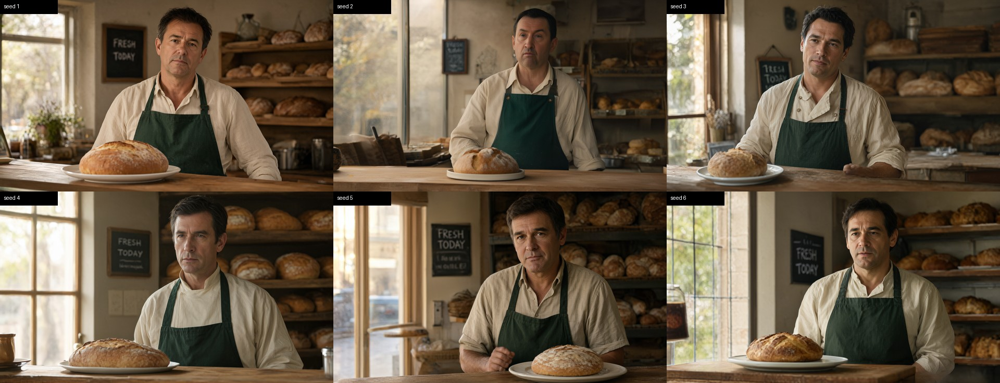

# keys-Mac-TensorFold-Studio (MiniMax H3 + Qwen-Image-2.1)

**Thank you to everyone this stands on:** the Qwen team at Alibaba (Qwen-Image-2.1, Qwen3-VL), the MiniMax team
(MiniMax H3), Ash Hart and the TensorFold contributors, antirez (h3.c), RobZombAI (H3MLX), mrbizarro (minimax-h3-mlx /
Phosphene), Filip Strand and the mflux contributors, Viggle (the image turbo adapter), speach1sdef178 (the 2x video
decoder), LightX2V (the video Turbo adapter), NVIDIA Research (Sol-Engine, Sol-Attn, Sol-H3), FastVideo (FastH3), and Apple's MLX team and every MLX
contributor. This pack is their work, ported, pinned and measured. See [CREDITS.md](CREDITS.md). Built with Qwen.

**1.5** · Mac Studio M5 Ultra 256 GB · [TensorFold](https://github.com/ashhart/TensorFold) **0.6.5** + two families:
**Qwen-Image-2.1** (text to image) and **MiniMax H3** (video with sound) · int8 kernels on the M5 tensor units ·
few-step adapters for both · a 2x video decoder for 2K finals

> **Update, 1.5 (2026-10-04): a new standard setting, and the best result this pack has made.** Video now takes
> **5 Turbo passes**, and the **sound is made again by the base model** against the finished picture. Judged by eye
> and ear by the pack's owner on speech and singing clips: 5 passes gave the best picture among 3, 4, 5 and 6, and
> the base-model sound fixed what was wrong with the adapter's (harsh, echo-like, thin). A 15 second clip takes 219 s
> this way against 606 s for the full 20 steps, which remain one switch away: `QUALITY=high`.

## How it works

1. **You write two prompts**: what the picture shows, and what happens in the clip (action, spoken or sung words,
   sound).
2. **Qwen-Image-2.1 makes the first frame** from the first prompt, in about 10 seconds with its turbo adapter. Or it
   makes several scouts for you to choose from.
3. **MiniMax H3 animates that frame** from the second prompt, with sound, in one of two modes:
   - **Standard (Turbo 5).** The Turbo adapter denoises picture and sound together in 5 passes. The adapter is then
     dropped and the base model denoises the sound again from scratch, 20 steps, with the finished picture held
     fixed. Each of those steps recomputes only the audio rows (about 4% of the sequence) against the picture's
     stored attention keys and values, so 20 steps cost less than one full pass.
   - **High quality (`QUALITY=high`).** The base model denoises picture and sound together for 20 steps, no adapter.
     About three times slower; calmer motion, softer picture, and the sound the standard mode's audio step is
     borrowed from.
4. **The decoders finish it.** The video decoder turns latents into frames, optionally at twice the size (the 2x
   decoder, for 2K). The audio decoder's output is kept clear of clipping, and a take that comes out thin gets its
   bass lifted.

Both transformers, the samplers, the adapter merges, the audio step, the int8 kernels and the image and video
decoders run in TensorFold on MLX.

**Scout, pick, animate, finish in 2K.** Six scout images from one prompt in 27 seconds; pick one; MiniMax H3 animates
it with sound and a 2x decoder finishes it in 2K: an 8 second clip at 2048x1152 in five minutes, or at 2560x1440 in
under eleven. A 1344x768 draft of the same 8 seconds takes 108 seconds.




The newest sample, made with the standard setting: [`samples/singer_standard_8s.mp4`](samples/singer_standard_8s.mp4)
(prompts `singer-image.txt` and `singer-video-8s.txt`). The baker clips below predate 1.5.

Prompts: [`prompts/baker-image.txt`](prompts/baker-image.txt) for the picture,
[`prompts/baker-video.txt`](prompts/baker-video.txt) for what happens. Clips: [`samples/`](samples/).

## The base-model audio step

The Turbo adapter is what makes the picture fast, and it is also what spoils the sound. So the sound is made twice:
once with the picture, by the adapter, and thrown away; then again by the base model, which is the one that sounds
right.

1. After the Turbo passes, the adapter-merged model is unloaded and the released weights are loaded (4 s).
2. The finished picture, the first frame and the prompt go through the model once, held still, and every block's
   attention keys and values over them are stored.
3. The audio starts again from noise and is denoised in 20 steps. Each step runs only the audio rows (1,206 of 29,009
   on a 15 second clip) against the stored keys and values: about 1.3 s a step instead of 24 s.

It is on by default whenever the adapter is used. `REVOICE=0` keeps the adapter's own sound; `REVOICE=<steps>` sets the
number of audio steps (20 is the only value tried). Proposed upstream as a draft, ashhart/TensorFold#405.

## The workflow

```bash
# 1. Scout: several first frames from one prompt, one model load (27 s for six), with a contact sheet
bash scripts/scout.sh "A lighthouse keeper in a yellow raincoat on a cliff at dusk, storm clouds behind him" 6 scouts/keeper
open scouts/keeper/sheet.jpg

# 2. Draft the motion from the one you like: 8 s at 1344x768 in under two minutes
IMAGE_FILE=scouts/keeper/scout_s3.png X2=1 FRAMES=192 bash scripts/studio.sh "" \
    "He raises a lantern, wind pulls at his coat, waves crash below. He says: Storm's coming." draft.mp4

# 3. Finish in 2K: same image, same prompt. TWOK=1 is 2048x1152 (5 min), QHD=1 is 2560x1440 (11 min)
IMAGE_FILE=scouts/keeper/scout_s3.png QHD=1 FRAMES=192 bash scripts/studio.sh "" \
    "He raises a lantern, wind pulls at his coat, waves crash below. He says: Storm's coming." final.mp4
```

Or all at once, with no picking: `TWOK=1 bash scripts/studio.sh "the picture" "what happens" out.mp4`.

- **Scouts are made at 1280x736**, which is exactly the frame the video model starts from for a 2560x1440 clip, so
  the scout you pick is the frame the clip opens on, with no resize in between.
- **Why 736 and not 720.** The video model needs sides in multiples of 32, and 720 is not one. The 2K preset
  generates at 1280x736, decodes at 2x to 2560x1472 and centre-crops 16 rows top and bottom to 2560x1440.
- **The draft and the final are different renders.** The draft generates at 672x384 and the final at 1280x736, so the
  motion is similar in kind, not frame for frame.

## Measured (2026-10-04, Mac Studio M5 Ultra 256 GB, macOS 27.0.1, one run each)

### Text to image to video (`scripts/studio.sh`), 8 second clips unless noted

| Output | Video generated at | Standard: Turbo 5 + base-model sound | Earlier: Turbo 3, adapter sound |
|---|---|---:|---:|
| Six scout images, 1280x736 (`scripts/scout.sh`) | | 27 s | 27 s |
| 1344x768, 2x decoder (`X2=1`) | 672x384 | **108 s** | 67 s |
| **2048x1152, 2x decoder (`TWOK=1`)** | 1024x576 | **299 s** | 151 s |
| **2560x1440, 2x decoder (`QHD=1`)** | 1280x736 | **635 s** | 352 s |
| 1344x768, native decode | 1344x768 | 709 s | 364 s |
| 864x480, native decode | 864x480 | 174 s | 98 s |
| 864x480, 5 s (124 frames), native decode | 864x480 | 103 s | 74 s |

Totals include the image (9-12 s). Where the standard time goes, 2048x1152: five passes 185 s (37 s each), the sound
made again 60 s, decode 31 s, loading and text 12 s. At 2560x1440: passes 436 s, sound 119 s, decode 55 s. The audio
step costs about one and a third passes at every size: one full pass to store the picture's keys and values, then 20
light steps.

`QUALITY=high` (20 steps, no adapter) took 606 s for a 15 second clip generated at 672x384, against 219 s at the
standard setting; it has not been timed at the sizes above.

The earlier column was measured with `POINTS=4 REVOICE=0`, which still works.

**Resolution costs far more than length.** The video model works on one row per 32x32 pixels of every latent frame,
and attention compares every row with every other, so its cost grows with the square of the row count. 5 s at 864x480
is 16,500 rows (9.5 s per pass); 8 s at 864x480 is 24,826 rows (18.3 s per pass); 8 s at 1344x768 is 60,403 rows
(104.6 s per pass). Going from 864x480 to 1344x768 is 2.5 times the pixels and 4 times the time for the same length.

**What the 2x decoder is.** A replacement head for H3's own video decoder (speach1sdef178's MiniMax-H3-X2-Detail-VAE)
that turns the same latents into frames twice as large along each side, in the normal decode time. It is an upscale: a
1344x768 clip decoded from a 672x384 generation is softer than one generated at 1344x768, with stair-steps on
high-contrast edges ([comparison](samples/x2_compare.jpg): native on top, 2x below). It earns its place twice: as a
6 times faster draft, and as the last step to 2K from a full-size generation, where the 2560x1440 clip costs no more
than the 1344x768 one. With `QHD=1` or `TWOK=1` the first frame is made at the size the video model starts from
(1280x736 or 1024x576), since a larger picture would only be shrunk again.

Wall time from the command to the finished files, both models loaded from disk each time, int8 kernels on. In every clip the baker lifts the loaf, speaks the scripted line
(checked by speech recognition) and smiles. The 864x480 run was the first after install, so its 14 s includes a cold
read of the text encoder.

### Qwen-Image-2.1 alone, 1344x768, same prompt and seed

| Path | Steps | Per step | Denoise | Whole run |
|---|---:|---:|---:|---:|
| mflux `add5164`, bfloat16 (the reference this port is checked against) | 40 | 0.73 s | 29 s | 40.7 s |
| TensorFold, bfloat16 | 40 | 0.78 s | 31.0 s | 34.3 s |
| TensorFold, int8 kernels | 40 | 0.48 s | 19.2 s | 24.3 s |
| **TensorFold, int8 kernels + Viggle turbo adapter** | **6** | 0.50 s | **3.0 s** | **9.2 s** |


Top: mflux, TensorFold bfloat16. Bottom: TensorFold int8, TensorFold int8 turbo. Against the mflux image the
TensorFold bfloat16 image is 32.7 dB and the int8 image 30.4 dB: the same picture with different fine detail. Turbo
gives the same scene with a different rendering.

- **Per step in bfloat16, mflux is slightly faster than this port** (0.73 s against 0.78 s). The gain comes from the
  int8 kernels (1.6x per step) and the 6-step adapter.
- **MiniMax H3 numbers**, the shootout against h3.c, H3MLX and minimax-h3-mlx, and what makes H3 fast are in the
  video-only pack: [keys-Mac-TensorFold-MiniMax-H3-MLX](https://github.com/drowzeys/keys-Mac-TensorFold-MiniMax-H3-MLX).
  At 20 steps the C engines are faster and sharper than TensorFold; TensorFold leads only with the Turbo adapter.

## One-shot

```bash
git clone https://github.com/drowzeys/keys-Mac-TensorFold-Studio.git
cd keys-Mac-TensorFold-Studio
brew install python@3.11 uv ffmpeg
bash oneshot-setup.sh               # both models and the 2x decoder: 182 GB of weights
bash oneshot-setup.sh --image-only  # or just Qwen-Image-2.1: 33 GB
```

`oneshot-setup.sh` does the following:

1. Gets TensorFold 0.6.5 with the H3 and Qwen-Image families (`drowzeys/TensorFold` at `218bfe24`), from the **GHCR
   prebuilt carrier** when Docker is available (checksums verified), otherwise from git at the same commit.
2. Installs it with mflux at `add5164e` and the dependency lock ([`requirements.lock`](requirements.lock): mlx 0.32.3,
   mlx-lm 0.32.0, mlx-vlm 0.7.4, …) into its own venv at `~/.local/opt/tensorfold-studio`.
3. Downloads `Qwen/Qwen-Image-2.1` (33 GB) to `~/qwen-models/Qwen-Image-2.1` and the Viggle turbo adapter (1.36 GB,
   checksum verified).
4. Unless `--image-only`: clones minimax-h3-mlx at `79190205`, downloads the MiniMax H3 `FL2VA` partition (144 GB) to
   `~/h3-models/MiniMax-H3`, the video Turbo adapter (1.96 GB) and the 2x video decoder (5.2 GB), both checksum verified.
5. Renders a test: a 5 second clip from a generated image (`outputs/test.png`, `outputs/test.mp4`), or a test image
   with `--image-only`.

Override `PREFIX`, `QWEN_MODEL_DIR` or `H3_MODEL_DIR` through the environment. `--verify` checks an existing install;
`--no-render` skips the test.

### Text to image to video

```bash
bash scripts/studio.sh "A lighthouse keeper in a yellow raincoat on a cliff at dusk, storm clouds behind him" \
                       "He raises a lantern, wind pulls at his coat, waves crash below. He says: Storm's coming." \
                       out.mp4
```

The image is written beside the clip (`out.png`). Defaults: 1344x768, 124 frames (5 s), native decode. `QHD=1` makes
a 2560x1440 clip; `X2=1` generates the video at half of `WIDTH` x `HEIGHT` and decodes at 2x (multiples of 64, up to
2688x1536); `IMAGE_FILE=picture.png` animates an image you already have. Set `FRAMES=192` for 8 seconds, `WIDTH`/`HEIGHT` for another canvas (multiples of 32, at most 768x1344 pixels in total, the video model's
released limit), `SEED`, or `IMAGE_SEED` and `VIDEO_SEED` separately. The script opens the video prompt with the line
MiniMax's own image-to-video prompts use; `RAW_PROMPT=1` passes yours untouched.

### Image only

```bash
bash scripts/image.sh "A neon shop sign that reads OPEN LATE, rainy night, reflections on wet pavement" out.png
TURBO=0 bash scripts/image.sh "..." out.png                 # 40 steps, base model
WIDTH=2048 HEIGHT=2048 bash scripts/image.sh "..." out.png  # sizes in multiples of 16
```

### Video only, or from your own image

```bash
bash scripts/video.sh "A hummingbird hovering over red flowers, soft wing hum" out.mp4
FIRST_FRAME=photo.jpg WIDTH=1344 HEIGHT=768 bash scripts/video.sh "She turns to the camera and smiles" out.mp4
QUALITY=high bash scripts/video.sh "..." out.mp4            # 20 steps, no adapter
```

`FRAMES` must be `17n + 5` (56, 73, 90, 124, 192, 243, 362). `FIRST_FRAME` is stretched onto the canvas, so match its
aspect ratio.

### GHCR prebuilt carrier

```bash
docker pull ghcr.io/drowzeys/keys-mac-tensorfold-studio:1.5
# index digest sha256:2c7a90daec93560123f6d5d970ff1e27b4a8bee8ebaa02879cddfc99998cd27f (linux/arm64 + linux/amd64)
docker run --rm -v "$PWD":/out ghcr.io/drowzeys/keys-mac-tensorfold-studio:1.5 cp -a /payload/. /out/payload/
```

The carrier holds the TensorFold wheel, `requirements.lock`, the two render scripts and `SHA256SUMS`. **It is not a
Mac runtime**: Metal does not run in a container, so `oneshot-setup.sh` installs the payload natively. Rebuild it with
`PUSH=1 bash scripts/build-carrier.sh`.

## Stack

| Piece | Value |
|---|---|
| Host | Mac Studio M5 Ultra, 256 GB, macOS 27.0.1 |
| Engine | TensorFold 0.6.5 (`609ca419`) + ten commits, `drowzeys/TensorFold` branch `studio` @ `218bfe2497ad8bf8f3d31a8c5943972244c9e9bc` (Apache-2.0) |
| Image model | `Qwen/Qwen-Image-2.1`: 7B transformer (32 blocks, bfloat16), 64-channel VAE, Qwen3-VL text encoder |
| Image adapter | `Viggle/Qwen-Image-2.1-viggle-turbo`, v0.3, rank 256, 6 steps on its trained nodes |
| Video model | `MiniMaxAI/MiniMax-H3`, `FL2VA` partition: 33B transformer, Qwen3-VL text encoder, video and audio VAEs |
| Video adapter | lightx2v MiniMax H3 Turbo v1.0, runner layout as published by Phosphene |
| 2x video decoder | `speach1sdef178/MiniMax-H3-X2-Detail-VAE`, `MiniMax-H3-X2-Detail-v1.safetensors` (decoder only; its reference-detail branch is not used) |
| Borrowed at run time | mflux @ `add5164e`: Qwen-Image prompt encoder. minimax-h3-mlx @ `79190205`: H3 text encoder, first-frame encoder, audio decoder, MP4 writer |
| MLX | 0.32.3 |
| Peak memory | image 28 GiB at 1344x768, 47 GiB at 2560x1472; video 64 GiB (the adapter is merged and quantized one block at a time; merging the whole model first peaked at 103 GiB) |

## Notes

- **Licences decide what you may do with this.** Qwen-Image-2.1 and the Viggle adapter are under the **Qwen Research
  License Agreement: non-commercial research and evaluation only**; commercial use needs a licence from the Qwen
  team. MiniMax H3 and the 2x decoder derived from it are under the MiniMax H3 Community License, which excludes some
  territories. This pack ships no
  weights. Read both licences before downloading.
- **This is a development render path, not a product.** There is no `tensorfold generate` command and no server; each
  script loads its model from disk and exits. The two models run one after the other, never together.
- **What TensorFold runs and what it borrows.** Both transformers, both samplers, the adapter merges, the int8
  kernels, the image decoder and the video decoder are TensorFold's. The Qwen-Image prompt encoder is mflux's, and
  the H3 text encoder, first-frame encoder, audio decoder and MP4 writer are minimax-h3-mlx's.
- **Qwen-Image here is text to image only.** Editing, reference images, transparent output and guidance with a
  negative prompt are not ported; mflux has them.
- **Sound (1.5).** With the Turbo adapter the sound was judged poor by ear: harsh on speech, worse on singing, with an
  echo-like quality. Measurements agree on one cause: the model makes two audio channels, which agree at 20 steps
  and disagree under the adapter. More passes, a mono fold-down, level changes and a different audio schedule did
  not fix it. Making the sound again with the base model did, and is now standard (`REVOICE=0` keeps the adapter's
  sound). The fast audio step is not identical to recomputing the whole sequence each step: on one clip the two
  gave the same loudness contour and tone but not the same waveform. Lip-sync was judged by eye, not measured.
- **Levels.** The audio decoder's hard clip at full scale is lifted and an overshooting take is turned down as a
  whole. A take whose 120-300 Hz band is weak gets a low shelf of up to 6 dB (`AUDIO_EQ=off` skips it); re-voiced
  takes have needed 2.5 to 5 dB.
- **Passes.** On a 15 second (362 frame) clip, 3 passes lost a detail (headphones) that 4, 5 and 6 kept, and 5 was
  preferred by eye. On an 8 second (192 frame) clip 3 passes kept it. `POINTS` sets passes plus one.
- **Quality is not graded.** Checked: stills of every clip, the scripted line by speech recognition, one image prompt
  against the mflux reference. Not checked: motion and audio by eye and ear, lip-sync, text rendering in general
  (the chalkboard reads "FRESH TODAY" at 1344x768 and comes out garbled at 864x480), other prompts and seeds.
- **Turbo adapters are distilled models.** They trade some fidelity for speed; `TURBO=0` (image) and `QUALITY=high`
  (video) run the base models.
- **M5 only for these numbers.** The int8 kernels need Metal 4 tensor operations; elsewhere both families run
  bfloat16 and slower.
- **Memory.** `--image-only` asks for 48 GB; the video model needs 128 GB+. On a 128 GB M5 Max the 5 s 864x480 test clip peaked at 64.3 GiB with no swap and took 278 s (25 s per pass against 9.5 s on the M5 Ultra); stop any other large model first.
- Proposed upstream as draft pull requests: the H3 family (ashhart/TensorFold#384), the Qwen-Image family (#393) and
  the audio step with the 2x decoder (#405). None is part of a TensorFold release.

## Credits

Cite the original authors first: the Qwen team (Qwen-Image-2.1), the MiniMax team (MiniMax H3), Ash Hart and the
TensorFold contributors, antirez (h3.c), RobZombAI (H3MLX), mrbizarro (minimax-h3-mlx, Phosphene), Filip Strand and
the mflux contributors, Viggle, speach1sdef178 (the 2x decoder), LightX2V, NVIDIA Research, FastVideo, and Apple MLX and its contributors. Full list:
[CREDITS.md](CREDITS.md). Pack: drowzeys / keys.
