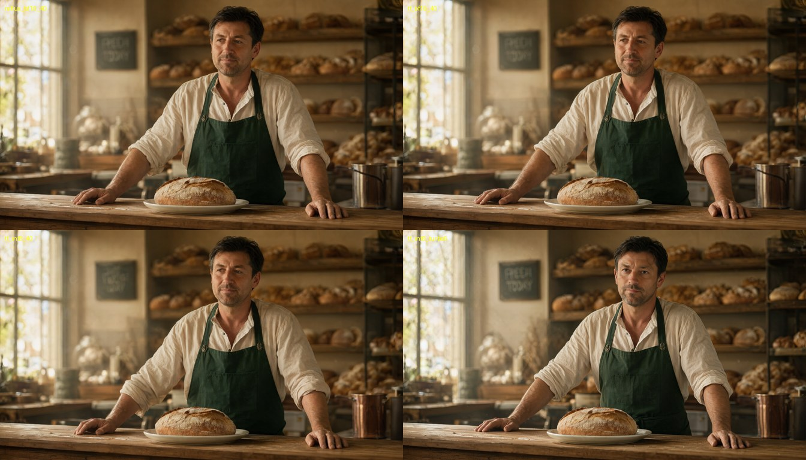

# keys-Mac-Tensorfold-Creator-Studio with MiniMax H3 + Qwen-Image-2.1 integrated

**Thank you to everyone this stands on:** the Qwen team at Alibaba (Qwen-Image-2.1, Qwen3-VL), the MiniMax team
(MiniMax H3), Ash Hart and the TensorFold contributors, antirez (h3.c), RobZombAI (H3MLX), mrbizarro (minimax-h3-mlx /
Phosphene), Filip Strand and the mflux contributors, Viggle (the image turbo adapter), LightX2V (the video Turbo
adapter), NVIDIA Research (Sol-Engine, Sol-Attn, Sol-H3), FastVideo (FastH3), and Apple's MLX team and every MLX
contributor. This pack is their work, ported, pinned and measured. See [CREDITS.md](CREDITS.md). Built with Qwen.

**1.0** · Mac Studio M5 Ultra 256 GB · [TensorFold](https://github.com/ashhart/TensorFold) **0.6.5** + two families:
**Qwen-Image-2.1** (text to image) and **MiniMax H3** (video with sound) · int8 kernels on the M5 tensor units ·
few-step adapters for both

**Type what the picture shows and what happens next; get an image in about 10 seconds and an 8 second 1344x768 clip
with sound six minutes after it.** One install, one command. Each model also runs on its own.


Both rows: [`prompts/baker-image.txt`](prompts/baker-image.txt) makes the first frame,
[`prompts/baker-video.txt`](prompts/baker-video.txt) animates it. Clips and the image: [`samples/`](samples/).

## Measured (2026-10-04, Mac Studio M5 Ultra 256 GB, macOS 27.0.1, one run each)

### Text to image to video (`scripts/studio.sh`)

| Output | Image | Video | Total |
|---|---:|---:|---:|
| 1344x768 image, then 8 s (192 frames) 1344x768 clip with stereo audio | 11 s | 353 s | **364 s** |
| 864x480 image, then 5 s (124 frames) 864x480 clip with stereo audio | 14 s | 60 s | **74 s** |

Wall time from the command to the finished files, both models loaded from disk each time. Both use the turbo adapters
(6 image steps, 3 video passes) and the int8 kernels. In both clips the baker lifts the loaf, speaks the scripted line
(checked by speech recognition) and smiles. The 864x480 run was the first after install, so its 14 s includes a cold
read of the text encoder.

### Qwen-Image-2.1 alone, 1344x768, same prompt and seed

| Path | Steps | Per step | Denoise | Whole run |
|---|---:|---:|---:|---:|
| mflux `add5164`, bfloat16 (the reference this port is checked against) | 40 | 0.73 s | 29 s | 40.7 s |
| TensorFold, bfloat16 | 40 | 0.78 s | 31.0 s | 34.3 s |
| TensorFold, int8 kernels | 40 | 0.48 s | 19.2 s | 24.3 s |
| **TensorFold, int8 kernels + Viggle turbo adapter** | **6** | 0.50 s | **3.0 s** | **9.2 s** |



Top: mflux, TensorFold bfloat16. Bottom: TensorFold int8, TensorFold int8 turbo. Against the mflux image the
TensorFold bfloat16 image is 32.7 dB and the int8 image 30.4 dB: the same picture with different fine detail. Turbo
gives the same scene with a different rendering.

- **Per step in bfloat16, mflux is slightly faster than this port** (0.73 s against 0.78 s). The gain comes from the
  int8 kernels (1.6x per step) and the 6-step adapter.
- **MiniMax H3 numbers**, the shootout against h3.c, H3MLX and minimax-h3-mlx, and what makes H3 fast are in the
  video-only pack: [keys-Mac-TensorFold-MiniMax-H3-MLX](https://github.com/drowzeys/keys-Mac-TensorFold-MiniMax-H3-MLX).
  At 20 steps the C engines are faster and sharper than TensorFold; TensorFold leads only with the Turbo adapter.

## One-shot

```bash
git clone https://github.com/drowzeys/keys-Mac-Tensorfold-Creator-Studio-with-MiniMaxH3-Qwen2.1-integrated.git
cd keys-Mac-Tensorfold-Creator-Studio-with-MiniMaxH3-Qwen2.1-integrated
brew install python@3.11 uv ffmpeg
bash oneshot-setup.sh               # both models: 177 GB of weights
bash oneshot-setup.sh --image-only  # or just Qwen-Image-2.1: 33 GB
```

`oneshot-setup.sh` does the following:

1. Gets TensorFold 0.6.5 with the H3 and Qwen-Image families (`drowzeys/TensorFold` at `b93f53b4`), from the **GHCR
   prebuilt carrier** when Docker is available (checksums verified), otherwise from git at the same commit.
2. Installs it with mflux at `add5164e` and the dependency lock ([`requirements.lock`](requirements.lock): mlx 0.32.3,
   mlx-lm 0.32.0, mlx-vlm 0.7.4, …) into its own venv at `~/.local/opt/tensorfold-studio`.
3. Downloads `Qwen/Qwen-Image-2.1` (33 GB) to `~/qwen-models/Qwen-Image-2.1` and the Viggle turbo adapter (1.36 GB,
   checksum verified).
4. Unless `--image-only`: clones minimax-h3-mlx at `79190205`, downloads the MiniMax H3 `FL2VA` partition (144 GB) to
   `~/h3-models/MiniMax-H3` and the video Turbo adapter (1.96 GB, checksum verified).
5. Renders a test: a 5 second clip from a generated image (`outputs/test.png`, `outputs/test.mp4`), or a test image
   with `--image-only`.

Override `PREFIX`, `QWEN_MODEL_DIR` or `H3_MODEL_DIR` through the environment. `--verify` checks an existing install;
`--no-render` skips the test.

### Text to image to video

```bash
bash scripts/studio.sh "A lighthouse keeper in a yellow raincoat on a cliff at dusk, storm clouds behind him" \
                       "He raises a lantern, wind pulls at his coat, waves crash below. He says: Storm's coming." \
                       out.mp4
```

The image is written beside the clip (`out.png`). Defaults: 1344x768, 124 frames (5 s). Set `FRAMES=192` for 8
seconds, `WIDTH`/`HEIGHT` for another canvas (multiples of 32, at most 768x1344 pixels in total, the video model's
released limit), `SEED`, or `IMAGE_SEED` and `VIDEO_SEED` separately. The script opens the video prompt with the line
MiniMax's own image-to-video prompts use; `RAW_PROMPT=1` passes yours untouched.

### Image only

```bash
bash scripts/image.sh "A neon shop sign that reads OPEN LATE, rainy night, reflections on wet pavement" out.png
TURBO=0 bash scripts/image.sh "..." out.png                 # 40 steps, base model
WIDTH=2048 HEIGHT=2048 bash scripts/image.sh "..." out.png  # sizes in multiples of 16
```

### Video only, or from your own image

```bash
bash scripts/video.sh "A hummingbird hovering over red flowers, soft wing hum" out.mp4
FIRST_FRAME=photo.jpg WIDTH=1344 HEIGHT=768 bash scripts/video.sh "She turns to the camera and smiles" out.mp4
ADAPTER=none POINTS=21 bash scripts/video.sh "..." out.mp4   # 20 steps, no adapter
```

`FRAMES` must be `17n + 5` (56, 73, 90, 124, 192, 243, 362). `FIRST_FRAME` is stretched onto the canvas, so match its
aspect ratio.

### GHCR prebuilt carrier

```bash
docker pull ghcr.io/drowzeys/keys-mac-tensorfold-studio:1.0
# index digest sha256:2cb2cf2df6558b850271b29e295cdbb56d81841ef0e9756c9ba7e8b2478ac1ac (linux/arm64 + linux/amd64)
docker run --rm -v "$PWD":/out ghcr.io/drowzeys/keys-mac-tensorfold-studio:1.0 cp -a /payload/. /out/payload/
```

The carrier holds the TensorFold wheel, `requirements.lock`, the two render scripts and `SHA256SUMS`. **It is not a
Mac runtime**: Metal does not run in a container, so `oneshot-setup.sh` installs the payload natively. Rebuild it with
`PUSH=1 bash scripts/build-carrier.sh`.

## Stack

| Piece | Value |
|---|---|
| Host | Mac Studio M5 Ultra, 256 GB, macOS 27.0.1 |
| Engine | TensorFold 0.6.5 (`609ca419`) + three commits, `drowzeys/TensorFold` branch `studio` @ `b93f53b428fa49f9041ed5953f4db78f20550ca2` (Apache-2.0) |
| Image model | `Qwen/Qwen-Image-2.1`: 7B transformer (32 blocks, bfloat16), 64-channel VAE, Qwen3-VL text encoder |
| Image adapter | `Viggle/Qwen-Image-2.1-viggle-turbo`, v0.3, rank 256, 6 steps on its trained nodes |
| Video model | `MiniMaxAI/MiniMax-H3`, `FL2VA` partition: 33B transformer, Qwen3-VL text encoder, video and audio VAEs |
| Video adapter | lightx2v MiniMax H3 Turbo v1.0, runner layout as published by Phosphene |
| Borrowed at run time | mflux @ `add5164e`: Qwen-Image prompt encoder. minimax-h3-mlx @ `79190205`: H3 text encoder, first-frame encoder, audio decoder, MP4 writer |
| MLX | 0.32.3 |
| Peak memory | image 28 GiB (15 GiB without the adapter); video 103 GiB during its adapter merge |

## Notes

- **Licences decide what you may do with this.** Qwen-Image-2.1 and the Viggle adapter are under the **Qwen Research
  License Agreement: non-commercial research and evaluation only**; commercial use needs a licence from the Qwen
  team. MiniMax H3 is under the MiniMax H3 Community License, which excludes some territories. This pack ships no
  weights. Read both licences before downloading.
- **This is a development render path, not a product.** There is no `tensorfold generate` command and no server; each
  script loads its model from disk and exits. The two models run one after the other, never together.
- **What TensorFold runs and what it borrows.** Both transformers, both samplers, the adapter merges, the int8
  kernels, the image decoder and the video decoder are TensorFold's. The Qwen-Image prompt encoder is mflux's, and
  the H3 text encoder, first-frame encoder, audio decoder and MP4 writer are minimax-h3-mlx's.
- **Qwen-Image here is text to image only.** Editing, reference images, transparent output and guidance with a
  negative prompt are not ported; mflux has them.
- **Quality is not graded.** Checked: stills of both clips, the scripted line by speech recognition, one image prompt
  against the mflux reference. Not checked: motion and audio by eye and ear, lip-sync, text rendering in general
  (the chalkboard reads "FRESH TODAY" at 1344x768 and comes out garbled at 864x480), other prompts and seeds.
- **Turbo adapters are distilled models.** They trade some fidelity for speed; `TURBO=0` and `ADAPTER=none POINTS=21`
  run the base models.
- **M5 only for these numbers.** The int8 kernels need Metal 4 tensor operations; elsewhere both families run
  bfloat16 and slower.
- **Memory.** `--image-only` asks for 48 GB; the video model needs 128 GB+. Measured on 256 GB only.
- The H3 family is proposed upstream as a draft pull request, ashhart/TensorFold#384. The Qwen-Image family is not
  proposed upstream yet. Neither is part of a TensorFold release.

## Credits

Cite the original authors first: the Qwen team (Qwen-Image-2.1), the MiniMax team (MiniMax H3), Ash Hart and the
TensorFold contributors, antirez (h3.c), RobZombAI (H3MLX), mrbizarro (minimax-h3-mlx, Phosphene), Filip Strand and
the mflux contributors, Viggle, LightX2V, NVIDIA Research, FastVideo, and Apple MLX and its contributors. Full list:
[CREDITS.md](CREDITS.md). Pack: drowzeys / keys.
