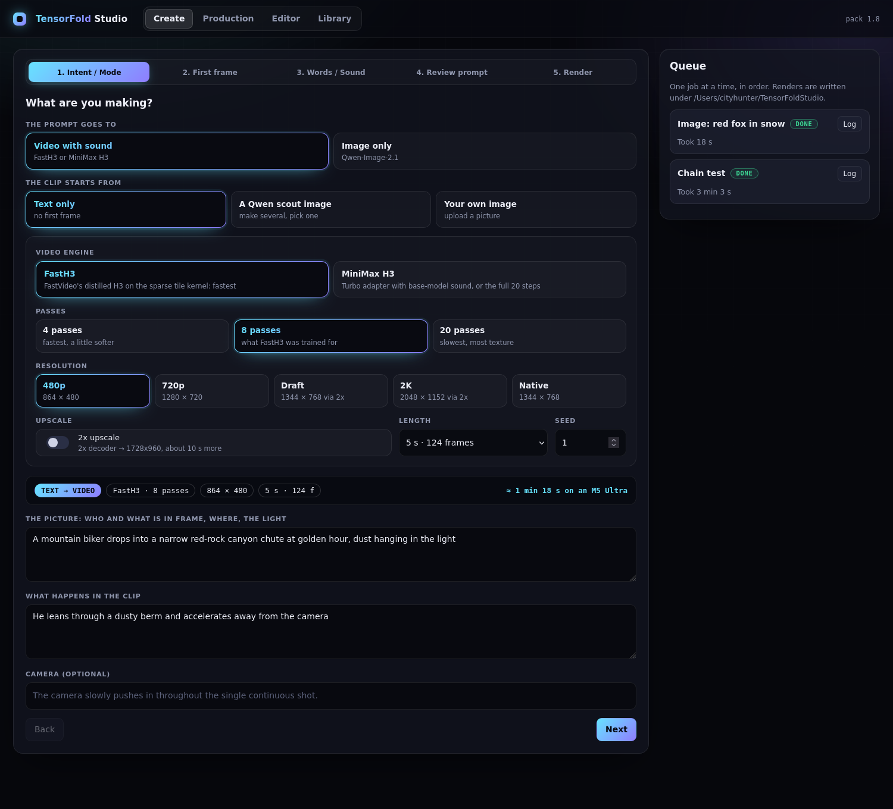
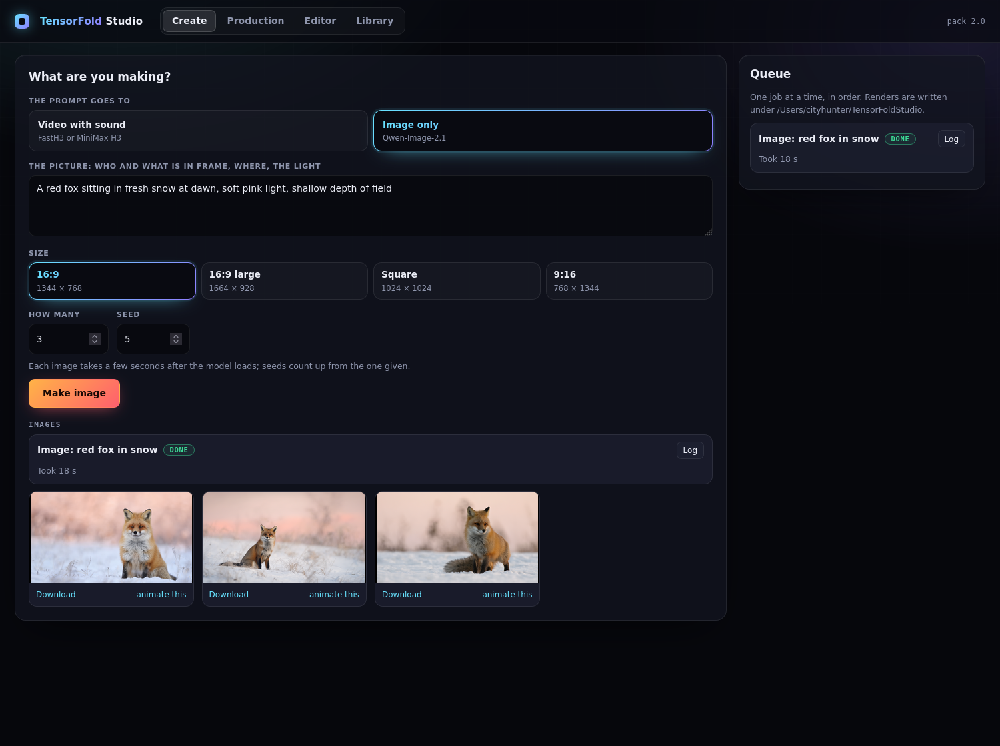
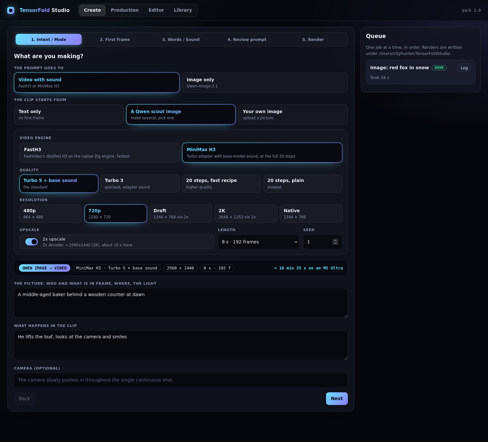
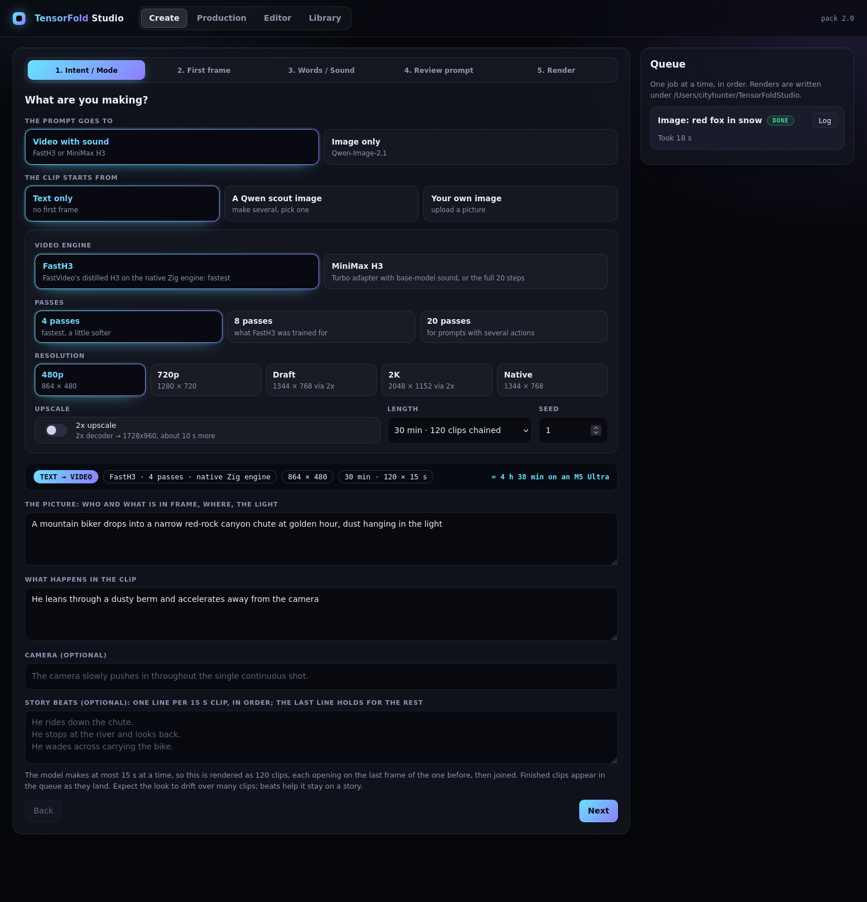

# TensorFold Studio: install it, click it, make things

**Thank you first** to the Qwen team (Qwen-Image-2.1), MiniMax (H3), FastVideo / Hao AI Lab (FastH3), Ash Hart
(TensorFold), mrbizarro, LightX2V, Viggle, speach1sdef178 and Apple's MLX team. Full list in [CREDITS.md](CREDITS.md).

What you get: an app on your Mac that turns a prompt into an **image**, or into a **video with sound**, from 5
seconds to 30 minutes, at 480p up to 2K.

## 1. Check your Mac

| Need | Why |
|---|---|
| Apple silicon with an **M5-family** chip | the fast kernels use its tensor units; other chips run far slower |
| **128 GB** memory or more | the video model alone holds about 65 GB while it runs |
| **250 GB** free disk (180 GB without FastH3) | model weights: 33 GB image, 144 GB video, 70 GB FastH3 |
| Homebrew | to install Python 3.11, uv and ffmpeg |

Everything here was measured on one machine: a Mac Studio M5 Ultra with 256 GB.

## 2. One-shot install

```bash
brew install python@3.11 uv ffmpeg
git clone https://github.com/drowzeys/keys-Mac-TensorFold-Studio.git
cd keys-Mac-TensorFold-Studio
bash oneshot-setup.sh --fasth3 --app
```

That one command installs the engine into its own folder (`~/.local/opt/tensorfold-studio`), downloads the models,
builds the app with a Desktop shortcut, and renders a 5 second test clip to prove it works. It can be stopped and
run again; downloads resume. Variants:

| Command | What it installs |
|---|---|
| `bash oneshot-setup.sh --fasth3 --app` | everything (about 250 GB) |
| `bash oneshot-setup.sh --app` | without FastH3 (about 180 GB); the FastH3 engine card will fail until you add it |
| `bash oneshot-setup.sh --image-only --app` | image model only (33 GB) |
| `bash oneshot-setup.sh --verify` | checks an existing install, downloads nothing |

The models have their own licenses: Qwen-Image-2.1 is **non-commercial**; MiniMax H3 and FastH3 are under the
MiniMax H3 Community License. The script prints the links before each download.

**Prefer to let an agent do it?** Give Claude Code (or another coding agent) this:

> Clone https://github.com/drowzeys/keys-Mac-TensorFold-Studio and follow its AGENTS.md section "Install for a
> person and build the one-click app". Tell me before any large download starts and when the app is ready.

## 3. The clickable app

`--app` already built it. To build or rebuild it yourself:

```bash
bash scripts/make-app.sh                # ~/Applications/TensorFold Studio.app
DESKTOP=1 bash scripts/make-app.sh      # and a shortcut on the Desktop
```

Double-click **TensorFold Studio**. It starts the studio if needed and opens it in your browser; double-click again
any time to come back. Drag it to the Dock to keep it there.

- It is a small launcher around the folder you cloned. If you move that folder, run `make-app.sh` again.
- Stop it: `"$HOME/Applications/TensorFold Studio.app/Contents/MacOS/TensorFoldStudio" stop`
- Log: `~/Library/Logs/TensorFoldStudio.log`. Everything you make: `~/TensorFoldStudio`.
- It listens on this Mac only, and has no login. `HOST=0.0.0.0 bash scripts/make-app.sh` opens it to your network;
  do that only on a network you trust.

## 4. Make a video from text



1. **The prompt goes to:** Video with sound. **The clip starts from:** Text only.
2. **Video engine:** FastH3 for speed. **Passes:** 8 (4 is faster and a little softer; 20 is slower and is the one to
   pick when the prompt has several distinct actions). The bar under the cards says which engine will run: text to
   video uses the native Zig engine on an M5.
3. **Resolution:** 480p or 720p. Turn on **2x upscale** for 1728x960 or 2560x1440.
4. **Length** and **Seed**, then describe the picture and what happens. *Next*.
5. Step 3: add spoken lines and the soundscape if you want them. Step 4: read the prompt. Step 5: **Queue this clip**.

On the M5 Ultra with the native engine a 5 second clip takes 43 s (4 passes), 66 s (8) or 129 s (20) at 480p, and
about 200 s at 720p with 8 passes; a 10 second 720p clip takes about 6½ minutes. 2x adds about 10 s.

If a clip leaves out part of the action, render it again at 20 passes. If the model reads something into the
prompt that you did not ask for, say so in the prompt ("unarmed hikers, no weapons").

## 5. Make an image only



**The prompt goes to:** Image only. Describe it, pick a size and how many, **Make image**. A few seconds each.
*Download* saves one; *animate this* makes it the first frame of a video.

## 6. Image first, then video



**The clip starts from:** A Qwen scout image. In step 2, make several candidates and click the one you like; the
video opens on exactly that picture. *Your own image* uploads one instead. Either engine works. With MiniMax H3 the
standard quality (Turbo 5 passes, sound made again by the base model) is the one judged best by ear.

## 7. Make a long video



Pick a **Length** from 30 s to 30 min. The model makes 15 s at a time, so the studio renders clip after clip, each
opening on the last frame of the one before, and joins them. Write **story beats**, one line per 15 s, to say what
happens in each part.

Be realistic: 30 minutes is roughly 7 to 11 hours of rendering at 480p (an estimate; the longest chain actually
rendered is 18 s), the look drifts over many clips, and sound does not carry across joins. For a real story, plan
it in **Production** instead.

## 8. Production, Editor, Library

- **Production:** a project of shots, each with its own scene, action, line and length; a shot can continue from the
  last frame of the one before. One button renders all that are not done.
- **Editor:** put clips in order, trim them, preview, export one file.
- **Library:** everything you have made. *use* turns an image into a first frame; *+ timeline* sends a clip to the editor.

## 9. Without the app

```bash
bash scripts/fast.sh "a prompt" out.mp4                          # FastH3: STEPS=4|8|20 RES=480p|720p UPSCALE=1
bash scripts/image.sh "a prompt" out.png                         # image only
bash scripts/studio.sh "the picture" "what happens" out.mp4      # Qwen image, then video (ENGINE=fasth3 for FastH3)
FIRST_FRAME=photo.jpg bash scripts/video.sh "what happens" out.mp4
```

## If something goes wrong

| What you see | What to do |
|---|---|
| "run oneshot-setup.sh first" | the install did not finish; run it again, it resumes |
| "no FastH3 checkpoint" | `bash oneshot-setup.sh --fasth3 --no-render` |
| The app says it did not start | read `~/Library/Logs/TensorFoldStudio.log`; often another program holds port 7870 (`PORT=7871 bash scripts/make-app.sh`) |
| A job fails | open its **Log** in the queue; the last lines say why |
| Very slow renders | check the chip is M5-family and nothing else is using the GPU |
| The job says "MLX engine" for FastH3 | expected when the clip starts from an image; for text to video, run `bash oneshot-setup.sh --fasth3 --verify` and look for the `tf-h3-dit` line |
